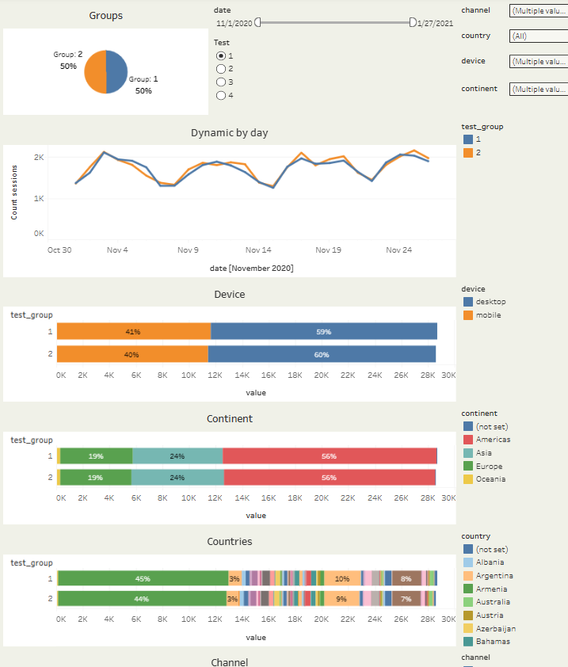

# A/B Testing Analysis

## Project Overview

This project demonstrates a complete A/B testing workflow applied to an e-commerce platform.
The dataset was extracted from BigQuery using a custom SQL query that aggregates session data, events, orders, and account creation across multiple dimensions.
The aggregated data was visualized in a Tableau dashboard and used to evaluate three independent test cases.

Each test case follows a structured analytical approach:

- Hypothesis formulation

- Traffic split validation (50/50)

- Distribution check by device, continent, country, and channel

- Statistical significance testing (Chi-Squared Test, 95% confidence level)

- Segment-level analysis

- Conclusions and actionable recommendations

## Tools & Technologies

- SQL (BigQuery)

- Tableau Public

- Evan's Awesome A/B Tools (Chi-Squared Test, Sample Size Calculator)

## Data Pipeline

The SQL query joins multiple BigQuery tables to build a unified analytical dataset:

- `DA.ab_test` – A/B test group assignments

- `DA.session` – session dates and IDs

- `DA.session_params` – session parameters (country, device, continent, channel)

- `DA.order` – order data

- `DA.event_params` – event-level data (add_to_cart, begin_checkout, add_payment_info, etc.)

- `DA.account_session` – new account creation events

The query aggregates data using CTEs and combines results via `UNION ALL` into a single output with dimensions: `date`, `country`, `device`, `continent`, `channel`, `test`, `test_group`, `event_name`, and `value`.

## Dashboard

The Tableau dashboard provides an interactive overview of each test, including:

- Group distribution validation (50/50 split)

- Daily dynamics by test group

- Segment breakdowns by device, continent, country, and channel

- Event comparison between control and experimental groups

## Test Cases & Key Insights

### Case 1: Button Design Testing (Larger Payment Button)

**Hypothesis:** Increasing the payment button size will raise `begin_checkout / session` by 5% without degrading `session with orders / session`.

**Primary metric:** `begin_checkout / session` — grew from 8.34% to 8.90% (+7%), **statistically significant** (p = 0.00289).

**Additional metric:** `session with orders / session` — increased by 0.6%, **not statistically significant** (p = 0.75). The guardrail metric was not negatively affected.

**Segment analysis:**

- Organic channel: statistically significant **negative** result (-8.41%).

- Tablets: strong negative trend across the majority of metrics (-32.53% for `begin_checkout`), though sample size is small.

- Africa: negative result across most metrics.

**Verdict:** ✅ Recommended for implementation, excluding Organic channel, tablet users, and users from Africa. After excluding negative segments, the expected growth reaches +15.95%.

---

### Case 2: Simplifying Product Selection (One Recommendation Instead of Three)

**Hypothesis:** Showing one product recommendation instead of three will simplify user choice and increase `add_to_cart / session` by 5%.

**Primary metric:** `add_to_cart / session` — increased by 10%, **statistically significant** (p < 0.001). Control: 5.55%, Experimental: 6.09%.

**Segment analysis:**

- Direct and Undefined channels showed a statistically insignificant drop.

- Asia showed a **statistically significant negative result** (p < 0.001): `add_to_cart` dropped by 17.69%.

**Verdict:** ✅ Recommended for implementation with exclusion of users from Asia. Keeping three recommendations for the Asian segment. Expected metric growth will be even higher after excluding the negative segment (+18.6%).

---

### Case 3: Simplifying Payment Information (Google Pay / Apple Pay)

**Hypothesis:** Adding Google Pay / Apple Pay will increase `add_payment_info / session` by 2% and `begin_checkout / session` by 2%.

**Primary metric:** `add_payment_info / session` — observed +1.5% growth, **not statistically significant** (p = 0.52). Required sample size for significance: ~1.28M sessions per group (current: ~70K).

**Additional metric:** `begin_checkout / session` — dropped by 3.4%, result is **statistically significant** (p = 0.012). The implemented changes negatively affected overall user behavior.

**Segment analysis:** For Undefined channels, both primary and additional metrics showed statistically significant positive changes.

**Verdict:** ❌ Not recommended for implementation. The primary metric requires an impractical sample size, and the additional metric showed a significant negative effect.

## How to Run

1. Clone this repository

2. Open `sql/ab_test_query.sql` to review the BigQuery query

3. Explore the Tableau dashboard (screenshot in `images/` or open the `.twbx` file in Tableau)

4. Review individual test case reports in the `cases/` folder

## Project Structure

ab-test-analysis/
- sql/
  - ab_test_query.sql
- cases/
  - Case_1_A_B_test_card.pdf
  - Case_2_A_B_test_card.pdf
  - Case_3_A_B_test_card.pdf
- dashboard/
  - AB.twbx
- images/
  - dashboard.png
- README.md
